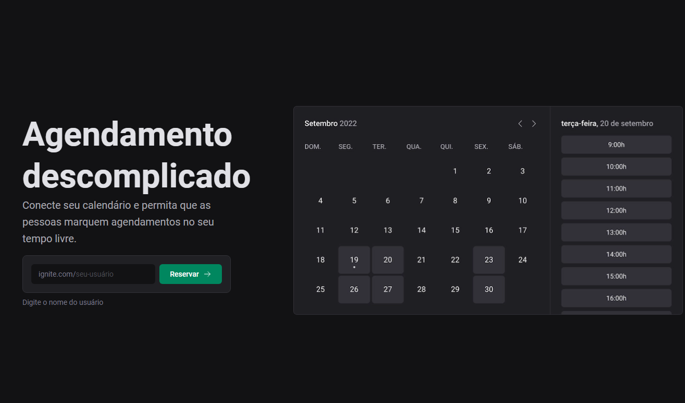

## Agendamento por email usando o google calendar

## Como executar a aplicação
Instalar as dependencias 
`npm install`  
Rodar a aplicação 
`npm run dev`

!!Necessário ter o Docker instalado no pc e criar um banco de dados no mesmo e deixa-lo em execução(seguindo os comandos abaixo de como utilizar o Docker)!! 

 

### Tecnologias utilizadas
- ReactJS
- Typescript
- Prisma
- Zod
- Docker
- MySQL

Desenvolvido durante o programa de especialização, Ignite da Rocketseat

 
 
 
 
 
 

Comando de instalação da interface de linha de comando do Prisma:  
` npm i prisma -D `

Comando de instalação da dependência que iremos utilizar na nossa aplicação: 
` npm i @prisma/client `

Comando para iniciar o Prisma: 
` npx prisma init --datasource-provider SQLite `

Comando pra rodar a migration: 
` npx prisma migrate dev `

Comando pra rodar o Prisma Studio: 
` npx prisma studio `

Biblioteca para melhorar a perfomace da aplicação, salvando os dados em cache  
` npm i @tanstack/react-query `

Comando utilizado para rodar o Docker:  
` docker run --name mysql -e MYSQL_ROOT_PASSWORD=docker -p 3306:3306 mysql:latest `

Comando utilizado para iniciar o container:
` docker start mysql `  

Comando utilizado para parar o container:  
` docker stop mysql `